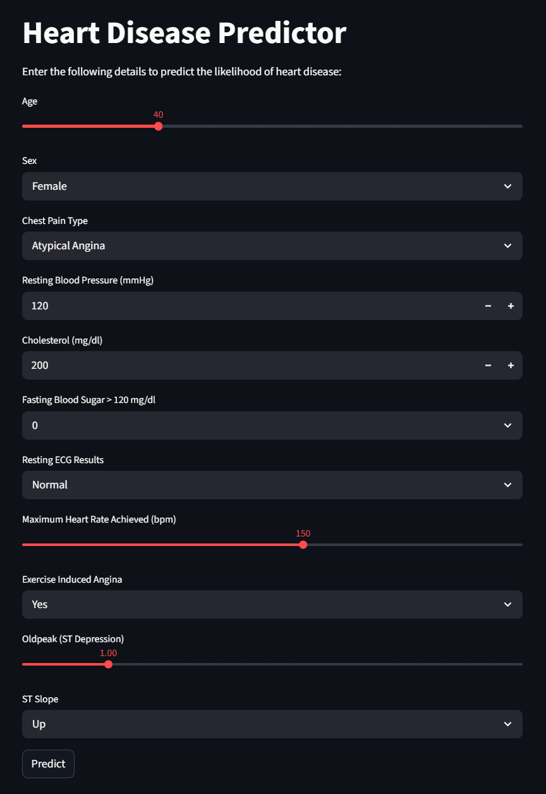

# ❤️ Heart Disease Predictor App

A Machine Learning-powered web application that predicts the likelihood of heart disease based on user health inputs. This project demonstrates an end-to-end ML workflow — from data preprocessing to model deployment using Streamlit.

---

## 🚀 Live Demo
🔗 https://heart-disease-predictor-by-tehulshah.streamlit.app/

---

## 📌 Project Overview

Heart disease is one of the leading causes of death worldwide. Early prediction can help in timely diagnosis and prevention.

This application allows users to input key health parameters and instantly receive a prediction about their heart disease risk.

---

## ⚙️ Tech Stack

- **Programming Language:** Python  
- **Libraries:** Pandas, NumPy, Scikit-learn  
- **Model Deployment:** Streamlit  
- **Model Serialization:** Joblib  

---

## 📊 Features

- ✅ User-friendly web interface built with Streamlit  
- ✅ Real-time prediction based on health metrics  
- ✅ Preprocessing pipeline (scaling + encoding)  
- ✅ Trained ML model for classification  
- ✅ Clean and interactive UI  

---

## 🧠 Machine Learning Workflow

1. Data Collection & Understanding  
2. Data Preprocessing  
3. Feature Engineering  
4. Model Training & Evaluation  
5. Model Serialization (`.pkl` files)  
6. Deployment using Streamlit  

---

## 🖥️ Application Preview



---

## 📂 Project Structure
├── data/
├── heart.ipynb
├── app.py
├── heart_disease_model.pkl
├── scaler.pkl
├── columns.pkl
├── requirements.txt
├── LICENSE
└── README.md

---

## ▶️ How to Run Locally

### 1. Clone the repository
```bash
git clone https://github.com/tehulshah/Heart-Disease-Predictor.git
cd Heart-Disease-Predictor
```
### 2. Install dependencies
```bash
pip install -r requirements.txt
```
### 3. Run the Streamlit app
```bash
streamlit run app.py
```

---

## 📥 Input Features

The model uses the following parameters:

- Age
- Sex
- Chest Pain Type
- Resting Blood Pressure
- Cholesterol
- Fasting Blood Sugar
- Resting ECG
- Maximum Heart Rate
- Exercise-Induced Angina
- Oldpeak
- ST Slope

---

## 📈 Output
- 0 → No Heart Disease
- 1 → High Risk of Heart Disease

---

## 💡 Key Learnings
- End-to-end ML pipeline development
- Feature encoding & scaling
- Model deployment using Streamlit
- Building real-world AI applications

---

## 🔮 Future Improvements
- Add model accuracy & evaluation metrics in UI
- Improve UI/UX design
- Deploy using Docker / cloud platforms
- Experiment with advanced models (XGBoost, Random Forest)

---

## 🤝 Contributing

Contributions are welcome! Feel free to fork this repository and submit a pull request.

---

## 📬 Contact

Tehul Shah - https://www.linkedin.com/in/tehulshah

## ⭐ If you like this project

Give it a ⭐ on GitHub — it motivates me to build more!

---